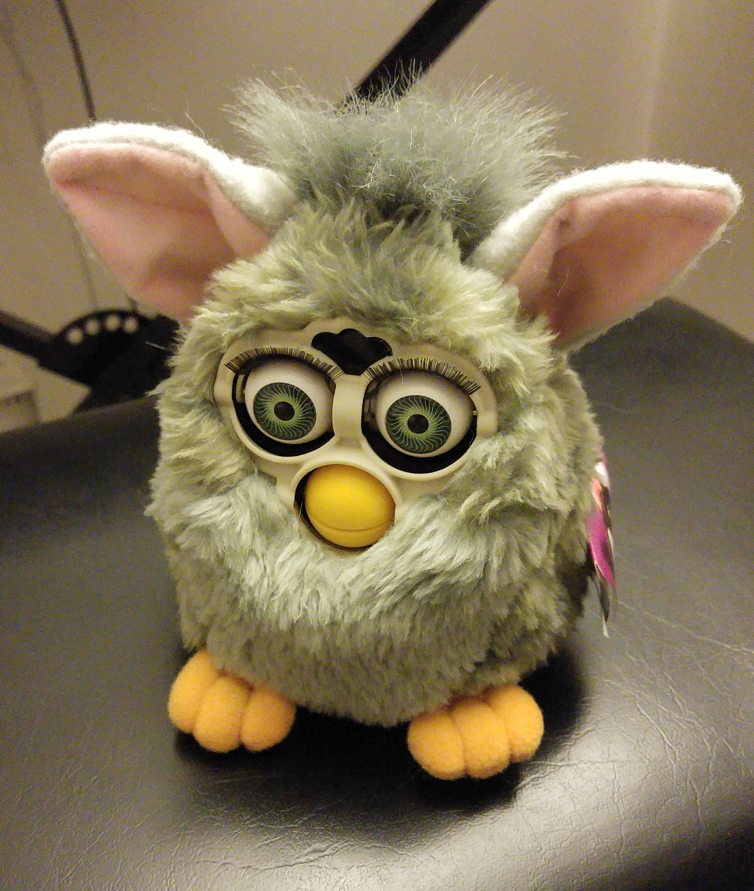
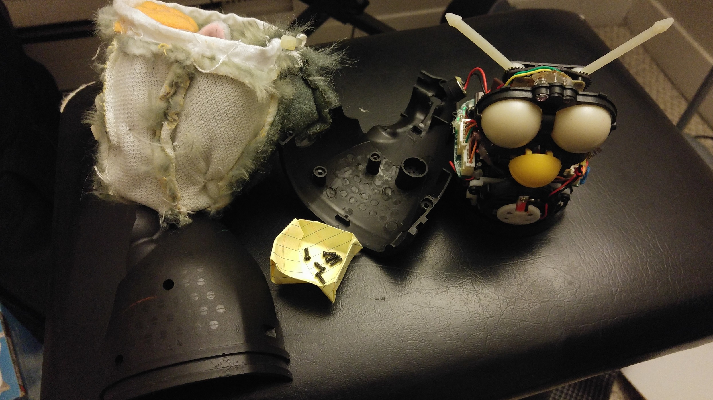
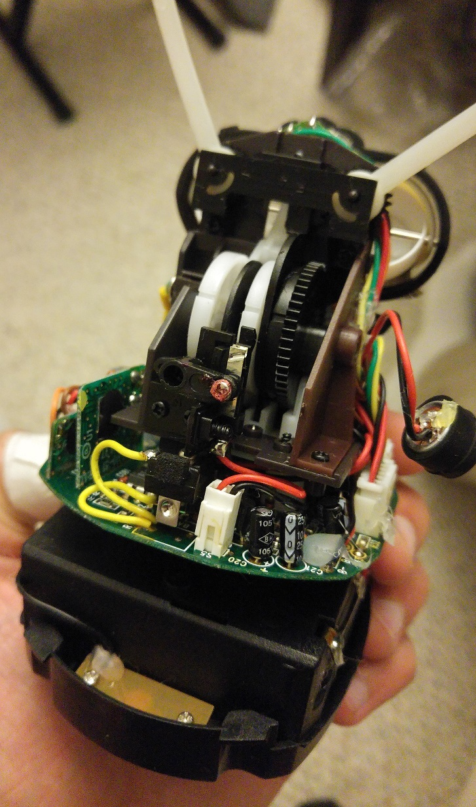

Have you heard of [C.H.I.P](https://getchip.com/pages/chip)? or [CHIP
Pro](https://getchip.com/pages/chippro)? It's really amazing how much
computing power you can get for less than the cost of a beer and a
burger. When I was in college I wanted to tinker around with embedded
computing - an uncle in the field pointed me at the
[Gumstix](https://www.gumstix.com/) series of boards, but the cost was
prohibitive for a cash-strapped student.

A while ago (maybe it was how I read about CHIP), I saw [this hack,
where the guts of a 1980's Teddy Ruxpin toy were replaced with a
CHIP](http://makezine.com/projects/chippy-ruxpin/). I wanted to make
one for my friend's birthday gift! I bounced the idea off of my
girlfriend whose questions quickly redirected the idea ("What's a
Teddy Ruxpin? Isn't the Furby a more appropriate toy for our
generation?") so, here is a log of the journey to the **Churby**.

## Taking apart a Furby ##

First, you need to get an older Furby. I grabbed two models from the
90's off of Ebay for about 20 dollars. I looked for ones listed as
"for repair" since we don't need a fully functional unit - we're
supplying our own logic board.

There are many tutorials that come up on disassembly. [Here's one from
Instructables](http://www.instructables.com/id/Push-Start-a-Comatose-Furby/)
that's for the model I have. We want to remove the fur in one piece
since we want to put it back on later.

These 'toys' are incredible. There's a speaker and microphone in the
body, IR diodes and receivers in the forehead, motors to control body,
ear, eye, and mouth movement, and several buttons strategically placed
to determine where Furby is being handled. The circuits are much
smaller than in the Teddy Ruxpin, but manageable even for an untrained
enthusiast - I could unplug most of the motor and sensor connections
and cleanly separate the head/torso of the unit from the logic
board. Onto the fun bits:

## Rewiring ##

